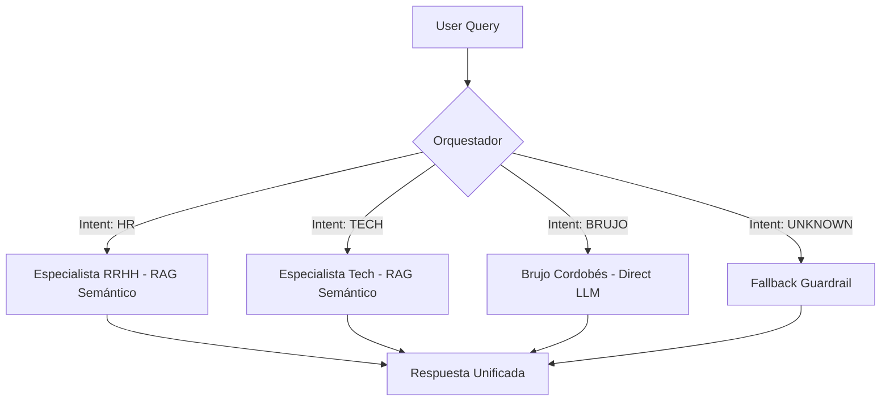

# 🤖 Multi-Agent System: Semantic RAG & Cosmic Wisdom

Este proyecto evoluciona un sistema multi-agente básico hacia una arquitectura robusta de **IA Semántica**, capaz de resolver dudas corporativas (HR/Tech) y consultas místicas (Astrología) con alta precisión y baja latencia.


## 🚀 Qué hace único a este proyecto

A diferencia del esqueleto base, esta versión implementa:

* **Motor Semántico:** Migración de búsqueda por palabras clave a una **Base de Datos Vectorial (ChromaDB)**. El sistema ya no busca "letras", entiende "conceptos" y sinónimos.
* **Arquitectura Híbrida:** Orquestación de agentes con **RAG** (Retrieval-Augmented Generation) para dominios técnicos y agentes **Zero-Shot** (el Brujo) para respuestas creativas, optimizando el uso de recursos.
* **Inferencia Ultra-Rápida:** Integración con **Groq** para ejecutar Llama 3.3 con tiempos de respuesta menores a 2 segundos.


## 🧠 Arquitectura del Sistema

El **Orquestador** actúa como un sistema nervioso central que clasifica la intención mediante un clasificador estructurado y deriva la consulta al especialista adecuado.




## 🛠️ Stack Tecnológico

| Componente | Tecnología |
| :--- | :--- |
| **Lenguaje** | Python 3.12 (Estabilidad garantizada para IA) |
| **Orquestación** | LangChain & Expression Language (LCEL) |
| **Embeddings** | `all-MiniLM-L6-v2` (Local via HuggingFace) |
| **Vector DB** | ChromaDB (Ephemeral Store) |
| **Inferencia** | Groq (Llama 3.3) |
| **Observabilidad** | LangSmith (Trazabilidad completa) |
| **Gestor de Paquetes** | `uv` (Fast dependency management) |


## 🔮 El Agente Brujo (Bonus Especial)

Se incorporó un agente místico que demuestra la capacidad del sistema para manejar **rutas no-documentales**. Mientras HR y Tech consultan manuales indexados, el Brujo utiliza el conocimiento base del modelo para brindar consejos astrales con un toque de humor local. Este agente no realiza procesos de *retrieval*, lo que reduce la latencia de respuesta.


## 🏁 Inicio Rápido

1.  **Sincronizar entorno:**
    ```bash
    uv sync
    ```
2.  **Configurar `.env`:**
    Asegurarse de incluir las siguientes claves:
    * `GROQ_API_KEY`
    * `LANGCHAIN_API_KEY`
    * `LANGCHAIN_TRACING_V2=true`

3.  **Ejecutar el sistema:**
    ```bash
    uv run python -m multi_agent_system.main --query "¿Qué dicen los astros para un programador de Tauro?"
    ```

---

> **Nota técnica:** Se optó por Python 3.12 para asegurar la compatibilidad con las validaciones de tipo de Pydantic v1 requeridas por ChromaDB, evitando conflictos presentes en versiones experimentales de Python.